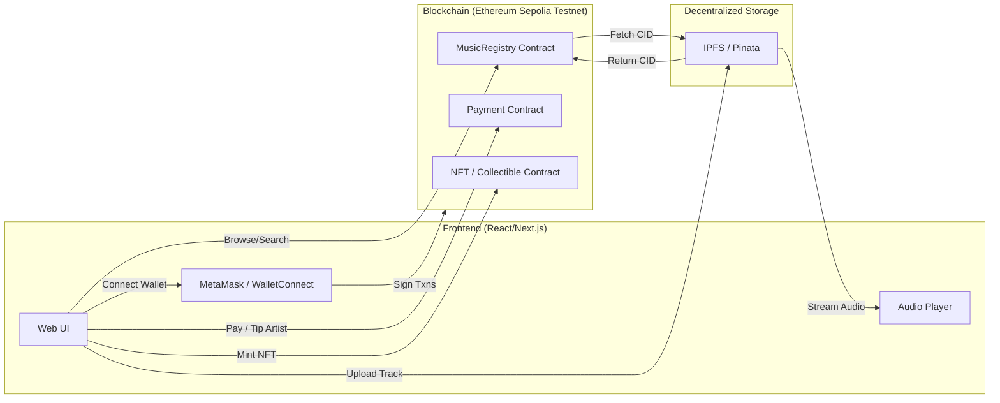

# PS-11: Decentralized Music Streaming Platform — Project Plan

A comprehensive roadmap for your team to go from **zero blockchain knowledge** to a **working Web3 music streaming dApp**.

---

## 1. Big-Picture Architecture

Here's how all the pieces fit together:



> [!NOTE]
> **In plain English:** Artists upload music files to IPFS (decentralized storage). The file's unique address (CID) gets registered on a blockchain smart contract. Fans connect their crypto wallets, browse the catalog from the blockchain, and stream audio directly from IPFS. Payments and NFTs are handled by additional smart contracts.

---

## 2. Recommended Tech Stack

| Layer                | Technology            | Why                                                            |
| -------------------- | --------------------- | -------------------------------------------------------------- |
| **Frontend**         | Next.js (React)       | SSR, routing, great ecosystem, huge community                  |
| **Styling**          | Tailwind CSS          | Fast, utility-first, easy to learn                             |
| **Blockchain**       | Ethereum (Sepolia)    | Most tutorials & tooling available; Sepolia testnet is free     |
| **Smart Contracts**  | Solidity              | Industry standard; tons of beginner material                   |
| **Dev Framework**    | Hardhat               | Best DX: local chain, testing, deployment, debugging           |
| **Frontend ↔ Chain** | ethers.js v6          | Lightweight library to talk to contracts from the browser       |
| **Wallet**           | MetaMask              | Most popular; easy setup                                       |
| **Decentralized Storage** | IPFS via Pinata  | Free tier, API-based uploads, no need to run your own IPFS node |
| **Audio Player**     | Howler.js or HTML5 `<audio>` | Simple, reliable audio playback                          |
| **Backend (optional)** | Node.js / Express   | Only if you need indexing/search beyond on-chain data          |

---

## 3. Phased Roadmap

### Phase 0 — Learn the Basics (Week 1)

> [!IMPORTANT]
> Everyone on the team should go through these together. You can't build what you don't understand.

| Topic                         | What to Learn                                                    | Resource                                                                                           |
| ----------------------------- | ---------------------------------------------------------------- | -------------------------------------------------------------------------------------------------- |
| What is a Blockchain?         | Blocks, transactions, consensus, wallets, gas                    | [Ethereum.org — Intro](https://ethereum.org/en/developers/docs/intro-to-ethereum/)                 |
| What is a Smart Contract?     | Code that lives on-chain, is immutable, and auto-executes        | [Ethereum.org — Smart Contracts](https://ethereum.org/en/developers/docs/smart-contracts/)         |
| Solidity Basics               | Variables, functions, mappings, events, modifiers                | [CryptoZombies](https://cryptozombies.io/) (interactive, game-based — **highly recommended**)       |
| What is IPFS?                 | Content-addressed storage, CIDs, pinning                        | [IPFS Docs — Concepts](https://docs.ipfs.tech/concepts/)                                           |
| What is MetaMask?             | Install it, create wallet, get Sepolia test ETH from a faucet    | [MetaMask Docs](https://docs.metamask.io/)                                                         |
| Hardhat Quickstart            | Set up a project, compile, test, deploy to local/testnet         | [Hardhat Tutorial](https://hardhat.org/tutorial)                                                    |

**Goal by end of Week 1:** Every team member can explain what a smart contract is, has MetaMask installed with Sepolia test ETH, and has deployed a "Hello World" contract using Hardhat.

---

### Phase 1 — Smart Contracts (Weeks 2–3)

Build the on-chain backbone of the platform.

#### Contract 1: `MusicRegistry.sol`
Stores the song catalog on-chain.

```
struct Track {
    uint256 id;
    address artist;
    string title;
    string artist_name;
    string genre;
    string ipfsCID;        // pointer to audio file on IPFS
    string coverArtCID;    // pointer to cover image on IPFS
    uint256 timestamp;
    uint256 playCount;
}

// Key functions:
uploadTrack(title, artistName, genre, ipfsCID, coverArtCID)
getTrack(trackId) → Track
getTracksByArtist(artistAddress) → Track[]
incrementPlayCount(trackId)
```

#### Contract 2: `Payment.sol`
Handles direct payments, tips, and royalty splits.

```
// Key functions:
tipArtist(artistAddress)    // fan sends ETH directly
streamPayment(trackId)      // micro-payment per stream (optional)
withdrawEarnings()          // artist withdraws accumulated balance

// Events:
TipReceived(fan, artist, amount)
StreamPayment(fan, trackId, amount)
```

#### Contract 3: `MusicNFT.sol` (ERC-721)
For exclusive collectibles and fan engagement.

```
// Built on OpenZeppelin ERC-721
mintCollectible(trackId, metadataURI)
// Metadata stored on IPFS, linked to specific tracks
```

**Deliverables by end of Week 3:**
- [ ] All 3 contracts written, compiled, and tested with Hardhat
- [ ] Unit tests for every public function
- [ ] Deployed to Sepolia testnet

---

### Phase 2 — IPFS Integration & Backend (Week 3–4)

#### IPFS Upload Flow
1. Sign up for [Pinata](https://www.pinata.cloud/) (free tier = 1 GB)
2. Use their API to upload audio files and cover art
3. Receive a CID (Content Identifier) back
4. Store the CID on-chain via `MusicRegistry.uploadTrack()`

```javascript
// Example: Upload to Pinata
const pinataSDK = require('@pinata/sdk');
const pinata = new pinataSDK({ pinataJWTKey: 'YOUR_JWT' });

const result = await pinata.pinFileToIPFS(readableStream, { pinataMetadata: { name: 'song.mp3' } });
console.log(result.IpfsHash); // ← This is the CID
```

#### Optional: Indexing Backend
On-chain data is slow to query. For search & filtering, consider a lightweight Express.js server that listens to contract events and indexes them into a simple database (SQLite or even JSON files).

---

### Phase 3 — Frontend (Weeks 4–6)

#### Pages to Build

| Page               | Key Components                                                                 |
| ------------------- | ------------------------------------------------------------------------------ |
| **Landing Page**    | Hero section, featured tracks, call-to-action                                  |
| **Browse / Explore**| Track grid/list, genre filters, search bar                                     |
| **Track Player**    | Audio player with controls, track metadata, tip button                        |
| **Artist Dashboard**| Upload form, track list, earnings overview, analytics                         |
| **Profile**         | Wallet-connected profile, listening history, owned NFTs                       |

#### Wallet Integration
```javascript
// ethers.js v6 — Connect MetaMask
import { BrowserProvider, Contract } from 'ethers';

const provider = new BrowserProvider(window.ethereum);
await provider.send("eth_requestAccounts", []);
const signer = await provider.getSigner();
const contract = new Contract(CONTRACT_ADDRESS, ABI, signer);
```

#### Audio Streaming from IPFS
```javascript
// Construct IPFS gateway URL from CID
const audioUrl = `https://gateway.pinata.cloud/ipfs/${track.ipfsCID}`;
// Use HTML5 <audio> or Howler.js to play
```

---

### Phase 4 — Polish & Advanced Features (Weeks 6–7)

- [ ] Responsive design (mobile + desktop)
- [ ] Fan engagement: comments, track ratings
- [ ] NFT collectibles marketplace
- [ ] Playlist creation and sharing
- [ ] Analytics dashboard for artists
- [ ] Community governance (token-based voting) — stretch goal

---

## 4. Suggested Team Division

> [!TIP]
> For a team of 3–4 people, this split works well. Everyone learns the basics together in Week 1, then specializes.

| Role                       | Responsibilities                                               |
| -------------------------- | -------------------------------------------------------------- |
| **Smart Contract Dev(s)**  | Write, test, and deploy Solidity contracts using Hardhat        |
| **Frontend Dev(s)**        | Build the Next.js UI, wallet integration, audio player          |
| **Integration / Full-stack** | IPFS uploads, connect frontend to contracts, optional backend |

---

## 5. Project Directory Structure

```
Decentralised_music_streaming/
├── blockchain/                    # Smart contract code
│   ├── contracts/
│   │   ├── MusicRegistry.sol
│   │   ├── Payment.sol
│   │   └── MusicNFT.sol
│   ├── test/
│   │   ├── MusicRegistry.test.js
│   │   ├── Payment.test.js
│   │   └── MusicNFT.test.js
│   ├── scripts/
│   │   └── deploy.js
│   ├── hardhat.config.js
│   └── package.json
│
├── frontend/                      # Next.js web app
│   ├── app/
│   │   ├── page.tsx               # Landing page
│   │   ├── explore/page.tsx       # Browse tracks
│   │   ├── track/[id]/page.tsx    # Track player
│   │   ├── dashboard/page.tsx     # Artist dashboard
│   │   └── profile/page.tsx       # User profile
│   ├── components/
│   │   ├── AudioPlayer.tsx
│   │   ├── TrackCard.tsx
│   │   ├── WalletConnect.tsx
│   │   └── UploadForm.tsx
│   ├── lib/
│   │   ├── contracts.ts           # ABI + addresses
│   │   ├── ipfs.ts                # Pinata upload helpers
│   │   └── web3.ts                # ethers.js setup
│   ├── public/
│   └── package.json
│
├── docs/                          # Documentation
│   └── architecture.md
│
└── README.md
```

---

## 6. Key Concepts Cheat Sheet

| Term                  | What It Means (in this project)                                                |
| --------------------- | ------------------------------------------------------------------------------ |
| **Smart Contract**    | A program that lives on the blockchain. Once deployed, it can't be changed.    |
| **Solidity**          | The programming language for Ethereum smart contracts. Looks like JavaScript.  |
| **ABI**               | A JSON description of your contract's functions. The frontend needs it.        |
| **Hardhat**           | A toolkit for compiling, testing, and deploying Solidity contracts.             |
| **ethers.js**         | A JavaScript library that lets your frontend talk to the blockchain.            |
| **MetaMask**          | A browser extension wallet. Users sign transactions with it.                   |
| **IPFS**              | Decentralized file storage. Files get a unique CID instead of a URL.            |
| **Pinata**            | A service that makes IPFS easy — upload files, get CIDs, done.                 |
| **CID**               | Content Identifier — a hash-based address for a file on IPFS.                  |
| **Testnet (Sepolia)** | A "practice" blockchain with free fake ETH. Use it for development.            |
| **Gas**               | The fee you pay to execute a transaction on Ethereum (free on testnet).         |
| **ERC-721**           | The standard for NFTs (Non-Fungible Tokens) on Ethereum.                       |
| **OpenZeppelin**      | A library of audited, reusable Solidity contracts (ERC-721, access control…).   |

---

## 7. Getting Started — First Steps (This Week)

1. **Everyone:** Install [MetaMask](https://metamask.io), create a wallet, switch to Sepolia testnet, get free ETH from [Sepolia Faucet](https://sepoliafaucet.com)
2. **Everyone:** Complete [CryptoZombies](https://cryptozombies.io/) Lesson 1–3 (takes ~2-3 hours)
3. **Everyone:** Follow the [Hardhat Tutorial](https://hardhat.org/tutorial) to deploy a basic contract
4. **Set up the project repo:** Initialize the directory structure above, set up the `blockchain/` Hardhat project and the `frontend/` Next.js app
5. **Start contracts:** Begin writing `MusicRegistry.sol` — just the `uploadTrack` and `getTrack` functions first

---

## Verification Plan

Since this is a planning/strategy document (no code changes), verification will happen as the team progresses through each phase:

### Automated Tests
- Smart contracts will be tested using Hardhat's testing framework (`npx hardhat test`)
- Frontend will use the dev server (`npm run dev`) for live preview

### Manual Verification
- Each phase has clear deliverables listed above
- The team should demo each phase to each other before moving on
- Final verification: the fully working app deployed on Vercel (frontend) + Sepolia (contracts)